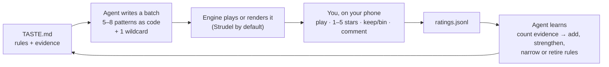

# MOOP

**MOOP** (music loop): grow your own music. *Mooping a track* = putting it through the loop: an agent writes it as code, you rate it, and your taste rules shape the next one.

An AI agent writes music as code, you rate it on your phone, and your ratings become
written-down taste rules that the next batch follows. A few rounds in, the music starts sounding like *your* taste
instead of the model's average.



**Swap any part.** The agent is whoever follows the skill cards in `agent/`. The engine is
[Strudel](https://strudel.cc) by default, with adapter stubs for TidalCycles, Sonic Pi, SuperCollider and AI music
APIs. Delivery is the built-in lab page, with stubs for Telegram and email. Rendering is optional and pluggable. The
fixed points are three small file formats: `batch.json` out, `ratings.jsonl` back, `TASTE.md` in between.

## Why music as code

- **You can read it, diff it and change it.** A pattern is a few lines of text. "Make the hats quieter" is a
  one-word edit, not a re-generation lottery.
- **Rules can be checked.** "At most four parts at once" is something an agent can follow and you can verify in the
  code, which is what makes a taste loop converge.
- **Fewer licence headaches.** Built-in synths plus your own recordings or CC0 sounds means you know where every
  sound came from. (Check every licence anyway: see `docs/licensing.md`.)
- **Cheap and fast.** Text in, text out. Strudel plays in any modern browser with no install and no GPU.

## Set it up with one prompt

Clone this repo, start your coding agent inside the folder, and paste the prompt in
[SETUP_PROMPT.md](SETUP_PROMPT.md). It checks what you have, asks about the vibe you want to grow (not songs to
copy), how you'll listen and rate, and your sounds, then sets up the lab and makes your first batch. Your answers
are saved, so you can run it again any time.

## Quick start

Needs Node 20 or newer. No dependencies to install.

```sh
npm test               # optional: run the test suite
npm run demo           # creates batches/demo/ from the example patterns
npm run lab            # starts the private lab on http://127.0.0.1:8787
```

On first start the lab writes a **one-time login link** to `.lab/login-link.txt` (it is never printed). Open it in
a browser on the same machine, or on your phone over a private network (see below). Press play, rate, comment.

Then the real loop:

1. Point your coding agent at `agent/make-batch.md`: *"Follow agent/make-batch.md and make the next batch."*
2. Rate the batch in the lab (about five minutes).
3. Point it at `agent/learn.md`: *"Follow agent/learn.md and update TASTE.md."*
4. Repeat.

Useful commands: `npm run check` (validate batches), `npm run report` (the evidence report the agent reads),
`npm run link` (a fresh login link), `npm run link -- --revoke` (log out everywhere).

## How the taste loop works

- Every batch item declares which rules it **follows**, and the one **wildcard** declares which rule it **breaks**
  (or which new idea it tests, via tags).
- You rate items 1–5, keep or bin, and comment. `keep`/`bin` wins; otherwise 4–5 stars counts as liked and 1–2 as
  disliked.
- `npm run report` counts evidence: a liked item that follows a rule supports it; a liked wildcard that broke a rule
  counts against it. Tags with a consistent signal are proposed as new rules. Nothing below 3 data points moves.
- The agent edits `TASTE.md` by hand (on purpose): strengthen, narrow, retire, propose. A loved idea becomes an
  **option** used in about 1 item in 4, never the new default. What you say outright ("never…", "always…") beats
  any count.

Start with `agent/TASTE.md` (three example rules), then read `docs/how-it-works.md` and `docs/taste-rules.md`.

## Rating from your phone

The lab binds to `127.0.0.1` only. To reach it from your phone, use a **private network** between your own devices,
for example [Tailscale](https://tailscale.com) with `tailscale serve` (tailnet only, not Funnel). Never port-forward
it or expose it to the public internet. Details and a Telegram option: `docs/sending-to-phone.md`.

## Responsible use

- **Original music only.** References are for feel, not for copying: never sample copyrighted songs and never have
  the agent reproduce a melody, hook or lyric. The skill cards say so too.
- **Check every sound's licence.** "Free to download" is not "free to use". Prefer your own recordings and CC0.
- **Approval stays human.** The agent proposes and learns; only you rate. Nothing here publishes or posts anything.
- **Keep the lab private.** One-time links, hashed sessions, strict CSP, localhost by default. Treat the login link
  like a password.
- **Paid APIs need your OK.** If you plug in an AI music API or a paid model, decide the budget yourself first.
- **Ear safety.** Generated audio can surprise you. Start quiet, especially on earbuds.

## Repo map

| path | what |
|---|---|
| `agent/` | skill cards (`make-batch.md`, `learn.md`, `render.md`), `TASTE.md` starter, `batch-format.md` |
| `lab/` | the private rating page (Node 20, zero dependencies) |
| `engines/` | engine adapters: Strudel (implemented) + stubs |
| `delivery/` | delivery channels: lab (implemented) + Telegram/email stubs |
| `lib/` | batch validation, ratings, auth, taste aggregation |
| `patterns/examples/` | five original example patterns, built-in synths only, CC0 |
| `samples/` | empty: your own or CC0 sounds + a `samples.json` map |
| `docs/` | how it works, writing taste rules, phone delivery, licensing |
| `tools/` | `link`, `demo`, `check`, `report` |
| `test/` | `node:test` suites |

## Licence

[AGPL-3.0-or-later](LICENSE). The example patterns are CC0. Strudel (AGPL-3.0-or-later) is not bundled; your browser
loads it at runtime from its official npm build. Your songs are yours. Why, and what that means:
[docs/licensing.md](docs/licensing.md).

---

Made by Jet Williams · jetworks: [https://jetworks.io](https://jetworks.io)
